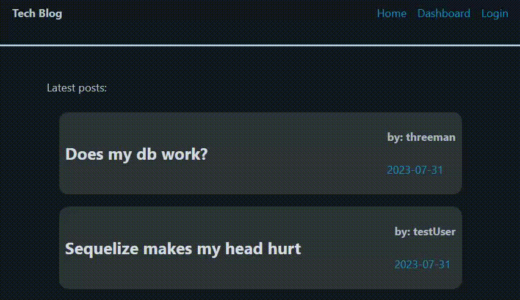
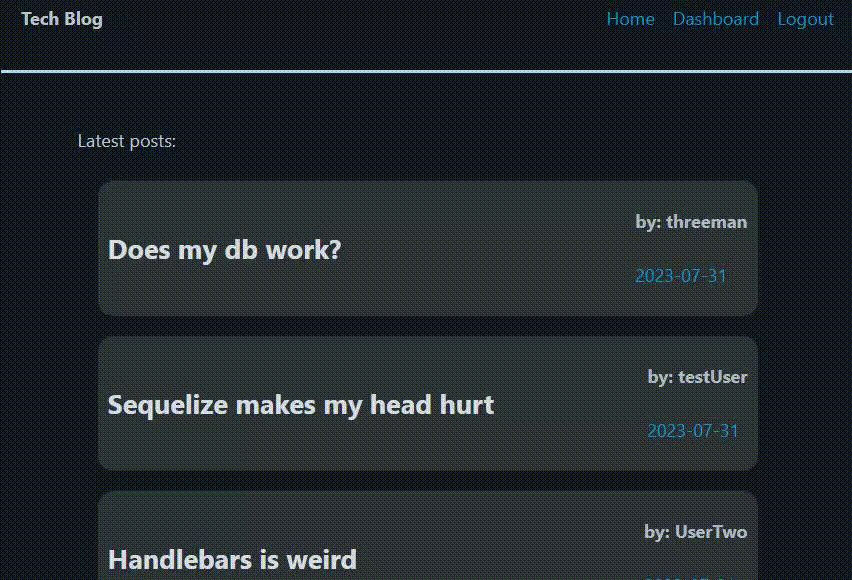
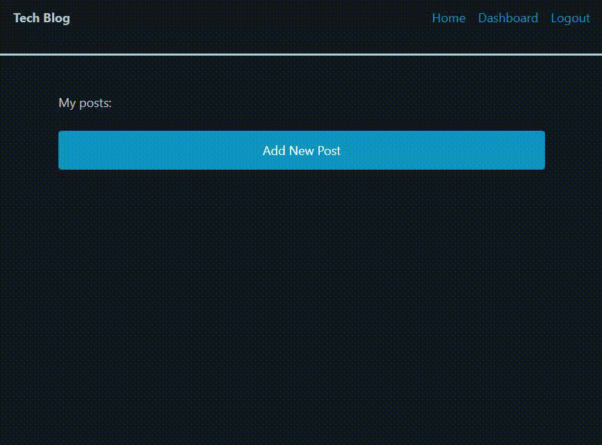
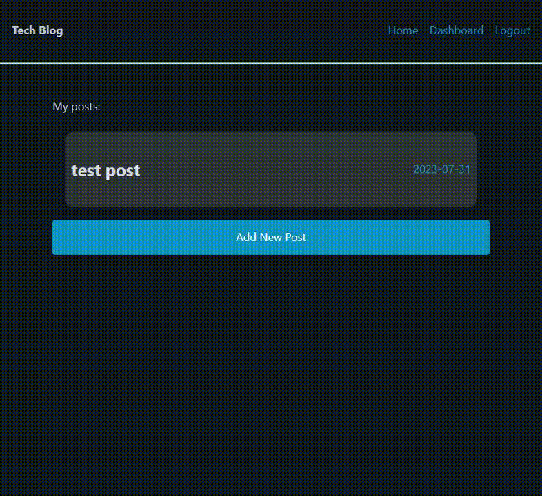

# CMS-Style Tech Blog

## Description

A CMS style blog built using Node/Sequelize for back-end and Handlebars for front-end. The user can create an account, author blog posts, comment on other posts, as well as edit/delete their own blog posts.

This is my first full stack web app I've built from scratch. As such it was quite the learning experience. Several npm packages are being used to make this webapp function, they can be found below in the Technologies section.

I wanted to make a responsive CMS style blog that allowed the user to create a blog post including a title and body, which could then have comments associated with it posted by other users. Sequelize was of great use here when creating new users, blogposts, and comments as I was able to designate associations and foreign keys using models. In addition to this I was able to make use of Express-Session to track whether or not someone viewing the page was logged in or not, meaning I could restrict certain pages depending on the state of the cookie.

It all came together on the page with the use of Handlebars to render different views based on what page was being visited, then to pull in what information was necessary to render blogposts, comments, date posted, and usernames as needed.

---
## Installation
This app is deployed on Heroku: [NOT YET IMPLEMENTED](http://google.com)

If you want to deploy this app locally you'll need to do the following:

- Clone the repository to your local machine
- Navigate to the project repository
- Type `npm install` in the terminal to install dependencies
- Type `npm run seed` to create and seed the database
- Type `npm run watch` to run the app using nodemon
- Navigate to http://localhost:3001 in your browser to view the live data
## Usage

There are several functionalities built into this webapp, but I tried to make them as intuitive as possible.

If you are not logged in you will be redirected to the login page when you try to navigate anywhere other than the homepage.

---

Once you are successfully logged in you can click on any of the blogposts from the homepage and click the 'post a comment' text to reveal the comment form. Type in a comment and click 'Submit comment' to save and post the comment.

---

To create a new blog post first navigate to your dashboard, then click the 'Add New Post' button to navigate to the form where you can submit a new blog post.

---

To edit or delete a blog post first navigate to your dashboard, then click on the post you want to edit or delete. From the edit page you can either edit the post title and content then click the 'Submit edited blogpost' button, or you can click the 'Delete post' button to delete that post.

---
## Technologies

- [bcrypt](https://www.npmjs.com/package/bcrypt) - An npm library to hash passwords.
- [connect-session-sequelize](https://www.npmjs.com/package/connect-session-sequelize) - a SQL session store using Sequelize.js.
- [dotenv](https://www.npmjs.com/package/dotenv) - An npm module that loads enviromnent variables from a .env file into process.env for added security.
- [express](https://www.npmjs.com/package/express) - Web framework for Node.js
- [express-handlebars](https://www.npmjs.com/package/express-handlebars) - A Handlebars view engine for Express.
- [express-session](https://www.npmjs.com/package/express-session) - A Node.js module that creates a session middleware using given options.
- [handlebars](https://www.npmjs.com/package/handlebars) - A templating language used to build semantic templates.
- [mysql2](https://www.npmjs.com/package/mysql2) - MySQL client for Node.js.
- [sequelize](https://www.npmjs.com/package/sequelize) - Promise-based Node.js ORM tool for SQL.

---